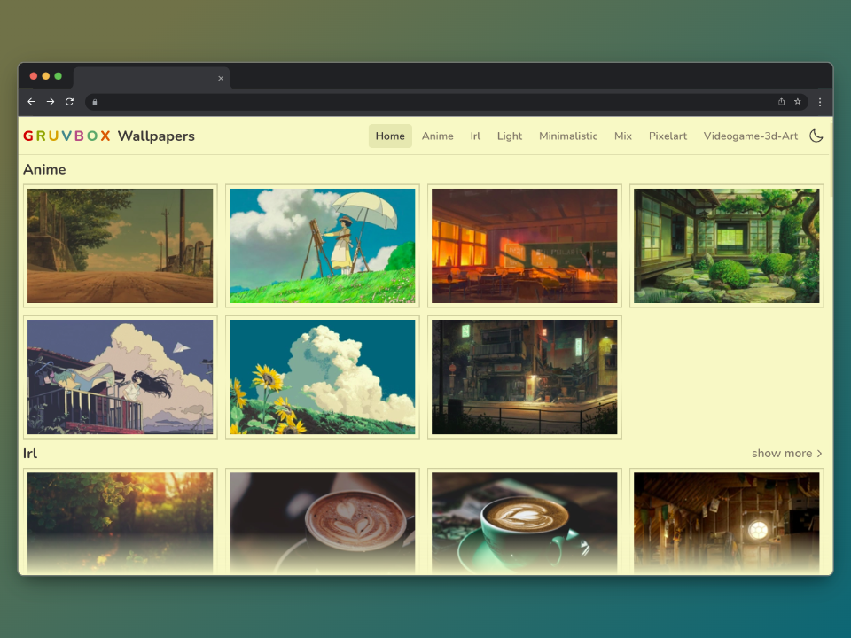
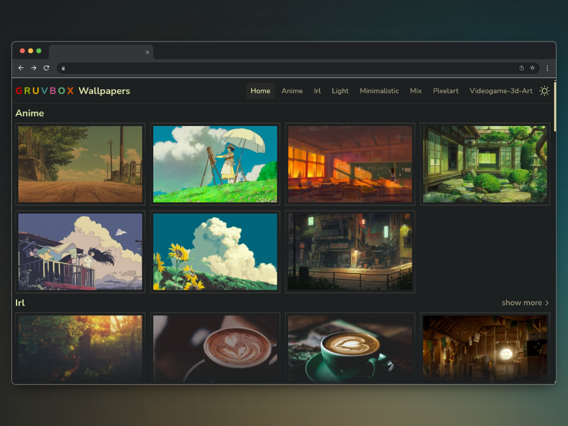
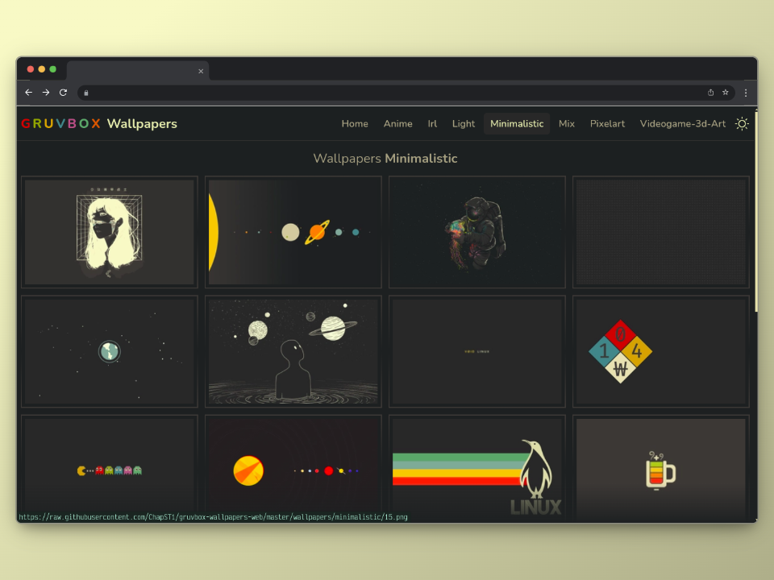

# GRUVBOX WALLPAPERS WEB

#### images from the repository https://github.com/AngelJumbo/gruvbox-wallpapers

  

## 🛠️ Stack

- [![Astro][astro-badge]][astro-url] - The web framework for content-driven websites.
- [![Typescript][typescript-badge]][typescript-url] - JavaScript with syntax for types.
- [![Tailwind CSS][tailwind-badge]][tailwind-url] - A utility-first CSS framework for rapidly building custom designs.

[astro-url]: https://astro.build/
[typescript-url]: https://www.typescriptlang.org/
[tailwind-url]: https://tailwindcss.com/
[astro-badge]: https://img.shields.io/badge/Astro-fff?style=for-the-badge&logo=astro&logoColor=bd303a&color=352563
[typescript-badge]: https://img.shields.io/badge/Typescript-007ACC?style=for-the-badge&logo=typescript&logoColor=white&color=blue
[tailwind-badge]: https://img.shields.io/badge/Tailwind-ffffff?style=for-the-badge&logo=tailwindcss&logoColor=38bdf8
